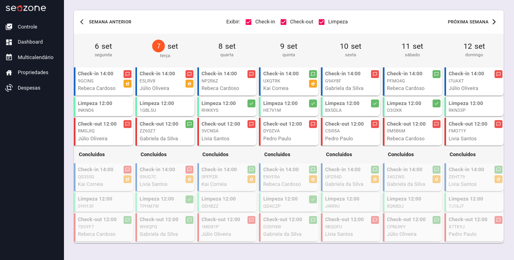
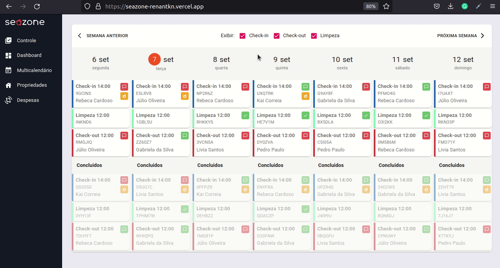
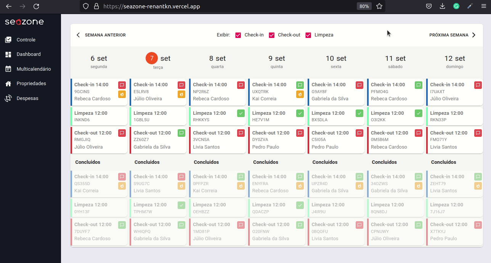
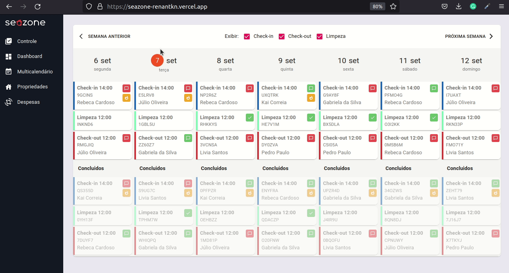
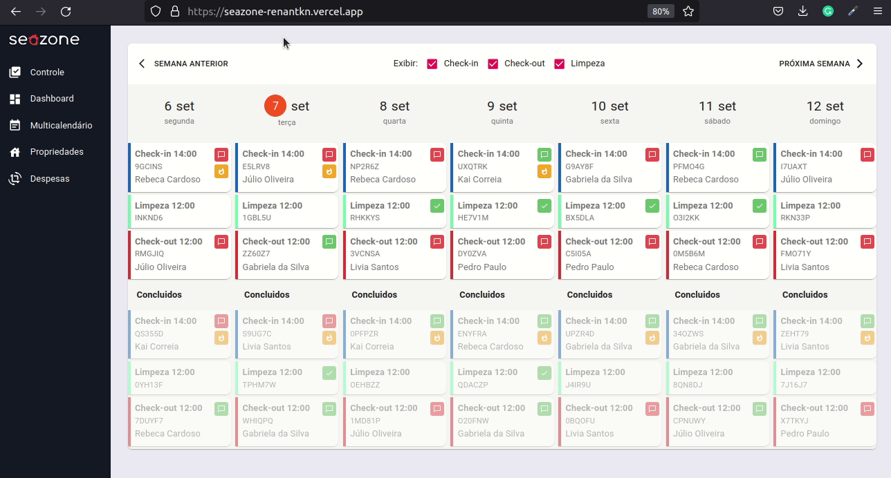

# Seazone

Este projeto foi feito em React, é um sistema sample para gerência da operação de imóveis.



# Funcionalidades

- Filtro por tipos de eventos (check-in, check-out e limpeza)



- Escolher a semana



- Inspecionar os cards dos eventos



- Diferentes rotas



- Os dados utilizados são gerados no próprio frontend, e alguns deles são aleatórios

# Técnologias utilizadas

- [React Router](https://reactrouter.com/)
  - Utilizado pela eficiencia e para a criação de rotas, embora só a primeira rota funcione as outras estão em WIP (Work In Progress)

- [Material-UI](https://material-ui.com/)
  - Material-UI possibilita a criação de forma rápida e limpa de componentes com uma interface gráfica limpa e responsiva, embora a responsividade não foi o foco do projeto, o Material-UI possibilita implementar interfaces mobile-friendly de forma simples. Outra razão pela escolha do Material-UI foi a semelhança com o design proposto e ícones disponibilizados.

- [Lodash](https://lodash.com/)
  - Bitlioteca muito útil com várias utilidades

- Outros pacotes React podem ser utilizados, mas como o projeto é apenas uma demo estes foram os pricipais escolhidos. O [axios](https://axios-http.com/), por exemplo, é um execelente pacote React para fazer requisições à uma API.

# Live Demo

Acesse este projeto pelo link https://seazone-renantkn.vercel.app/

# Rodando de forma local

```shell
git clone git@github.com:RenanTKN/seazone.git
cd seazone
yarn install # or npm install
yarn start # or npm start
```
# Integrando com o backend

Para integrá-lo com o backend é necessário utilizar os dados retornados pelo backend no lugar de utilizar os mocked-data do front-end.

O arquivo que gera os dados para o backend é o `src/data.ts` e ele é importado pelo `src/contexts/TasksContext.tsx`. Esta mudança irá requerer algumas alterações no código, como adição de [promisses](https://developer.mozilla.org/en-US/docs/Web/JavaScript/Guide/Using_promises) e alterção de alguns types definidas no frontend.
